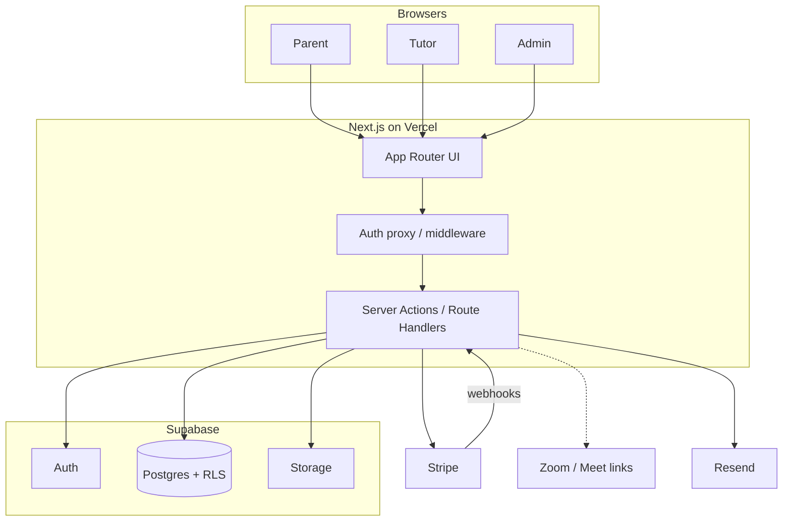
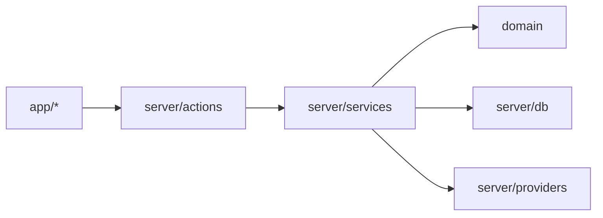
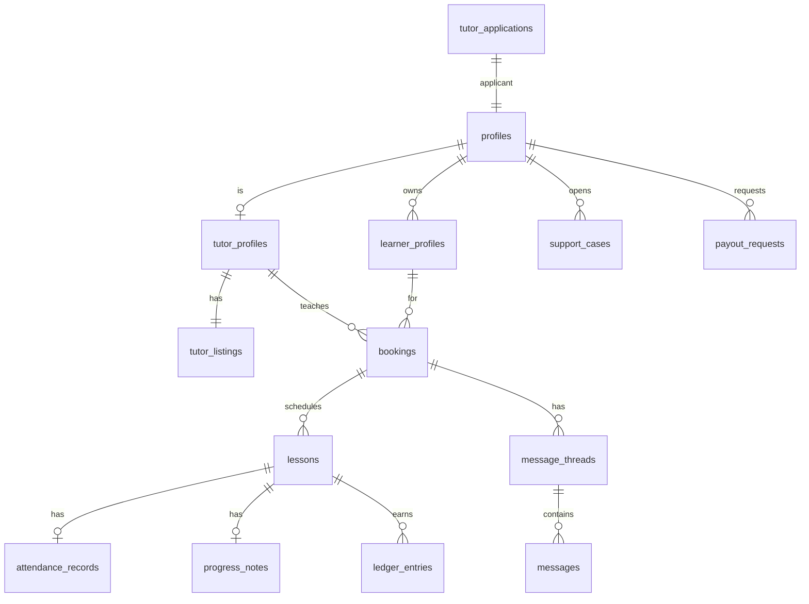

# Architecture Spine — Quran Tutor Marketplace

## Design Paradigm

**Modular monolith** on Next.js App Router: one deployable web app owns UI, Server Actions/Route Handlers, and orchestration. **PostgreSQL (Supabase)** is the system of record for domain state. **Stripe** is the system of record for payment intent and settlement events. **External video** (Zoom/Meet) is link-out only — not a first-party media plane.

Layer map:

| Layer | Lives in |
| --- | --- |
| Experience (pages, shells) | `app/(marketing)`, `app/(parent)`, `app/(tutor)`, `app/(admin)` |
| Application use-cases | `src/server/actions/*`, `src/server/services/*` |
| Domain types + invariants | `src/domain/*` |
| Data access | `src/server/db/*` (Supabase clients; SQL/migrations) |
| Providers | `src/server/providers/{stripe,email,video}/*` |



## Invariants & Rules

### AD-1 — Single identity plane [ADOPTED]

- **Binds:** FR-1..FR-3, all authenticated surfaces
- **Prevents:** Dual auth systems (e.g. Clerk + Supabase) with divergent user IDs
- **Rule:** Supabase Auth is the only identity provider. Profiles in Postgres reference `auth.users.id`. Do not add a second IdP in MVP.

### AD-2 — Postgres owns domain; Stripe owns money movement [ADOPTED]

- **Binds:** FR-16..FR-18, FR-12, monetization
- **Prevents:** Booking/ledger state that disagrees with Stripe; hand-edited “paid” flags
- **Rule:** Lesson packages, bookings, ledgers, and commission lines live in Postgres. Payment success/failure is applied only from verified Stripe webhooks (or Stripe API confirmations in trusted server code). UI never marks a Paid Lesson paid from client assertion alone.

### AD-3 — Platform Payments only

- **Binds:** FR-16, FR-24, trust NFRs
- **Prevents:** Features that instruct or enable student↔tutor direct transfer
- **Rule:** No product surface may collect or display tutor personal payment details for receiving lesson fees. Payouts go tutor ← platform via Stripe Connect **or** recorded payout rail `[ASSUMPTION: Stripe Connect Express for global USD launch; confirm in implementation]`.

### AD-4 — Authorization via roles + RLS

- **Binds:** all data access
- **Prevents:** Two modules inventing incompatible permission checks
- **Rule:** Every table with user data has RLS. Roles (`parent`, `tutor`, `admin`) live in `profiles.role` (or equivalent). Server uses user-scoped Supabase client by default; **service-role** only in Route Handlers/webhooks/admin jobs, never in Client Components or bundled browser code.

### AD-5 — Parent custody for minors + Parent-Visible messaging

- **Binds:** FR-2, FR-19, FR-14
- **Prevents:** Private child↔tutor channels or orphan minor accounts
- **Rule:** Learner Profiles under 18 require a Parent Account. All messages for that relationship are stored as Parent-Visible Thread rows readable by parent, tutor, and admin. Join links are exposed only via parent/tutor booking views — not a child-only inbox.

### AD-6 — Mutations go through server use-cases

- **Binds:** all write paths
- **Prevents:** Ad-hoc client writes bypassing domain rules (trial without card, double-book, etc.)
- **Rule:** Domain writes (book trial, convert, attendance, progress note, rematch, vetting) execute in Server Actions or Route Handlers that call `src/server/services/*`. Client Components do not hold service-role keys and do not write business tables directly except via those actions.

### AD-7 — Idempotent provider webhooks

- **Binds:** Stripe (and future providers)
- **Prevents:** Double credit / double commission on retries
- **Rule:** Webhook handlers persist `provider_event_id` uniquely before side effects; replays no-op.

### AD-8 — External video is a URL, not a subsystem

- **Binds:** FR-14
- **Prevents:** Building WebRTC/classroom in MVP
- **Rule:** Each session stores a `meeting_url` (and optional passcode). Creation may be manual paste or thin API later; architecture must not require in-app media SFU for MVP.

### AD-9 — Audit privileged ops

- **Binds:** FR-6, FR-24, FR-25
- **Prevents:** Untraceable vetting/suspend/commission changes
- **Rule:** Admin actions that change application status, suspension, rematch, or commission config append an `audit_log` row (actor, action, entity, before/after, timestamp).

### AD-10 — Dependency direction

- **Binds:** all modules
- **Prevents:** Domain importing Next.js UI; providers importing pages
- **Rule:** `domain` ← `server/services` ← `actions/routes` ← `app/*`. `providers` may be used only from `server/*`. No import from `app/*` into `domain` or `providers`.



## Consistency Conventions

| Concern | Convention |
| --- | --- |
| IDs | UUID v4 for all primary keys |
| Time | Store UTC (`timestamptz`); display in user timezone |
| Money | Integer minor units (cents) + `currency` code (`USD` MVP) |
| Errors | Typed error codes from services; map to user-safe messages at action boundary |
| Naming | DB `snake_case`; TS `PascalCase` types / `camelCase` values |
| Auth check | Server: `supabase.auth.getUser()` (not trust-only `getSession`) for authorization gates |
| Env | `NEXT_PUBLIC_*` only for anon keys/publishable; secrets server-only |
| UX tokens | Implement against finalized `DESIGN.md` / `EXPERIENCE.md` |

## Stack

| Name | Version |
| --- | --- |
| Node.js | 20.12+ (engines) |
| Next.js | 16.2.x (App Router) `[verified npm 16.2.10]` |
| React | 19.x (as required by Next 16) |
| TypeScript | 5.x |
| Supabase JS | 2.x `[verified npm 2.110.7]` |
| @supabase/ssr | current 0.12.x line |
| PostgreSQL | Supabase-managed |
| Stripe SDK | 22.x `[verified npm 22.3.2]` |
| Resend | latest at scaffold |
| Tailwind CSS + shadcn/ui | per UX ASSUMPTION |
| Hosting | Vercel |
| Video | Zoom and/or Google Meet links |

Starter seed: `create-next-app` (App Router, TS, Tailwind, ESLint) + Supabase project + Stripe account.

## Structural Seed

```text
/
  app/
    (marketing)/          # landing, browse, listing public
    (auth)/               # sign-in, register, verify
    (parent)/             # parent shell
    (tutor)/              # tutor shell
    (admin)/              # admin shell
    api/stripe/webhook/   # Stripe webhook route
    api/cron/             # optional payouts/reminders
  src/
    domain/               # types, pure rules
    server/
      actions/
      services/
      db/
      providers/
    components/           # shared UI
    lib/                  # cn(), formatters
  supabase/
    migrations/
    policies/
  _bmad-output/           # planning artifacts (not runtime)
```



Core entities (names only): `profiles`, `learner_profiles`, `tutor_applications`, `tutor_profiles`, `tutor_listings`, `bookings`, `lessons`, `attendance_records`, `progress_notes`, `message_threads`, `messages`, `reviews`, `support_cases`, `ledger_entries`, `payout_requests`, `audit_log`, `provider_events`.

## Capability → Architecture Map

| Capability / Area | Lives in | Governed by |
| --- | --- | --- |
| Accounts / roles | Auth + `profiles` | AD-1, AD-4 |
| Tutor vetting | `tutor_applications`, admin services | AD-4, AD-6, AD-9 |
| Browse / listing | public queries + RLS read of listings | AD-4 |
| Trial / recurring book | `bookings`/`lessons` services | AD-5, AD-6 |
| Payments / commission | Stripe + `ledger_entries` | AD-2, AD-3, AD-7 |
| Messaging | `messages` services | AD-5 |
| Progress / reviews | notes + reviews services | AD-6 |
| Rematch / cases | support services | AD-6, AD-9 |
| Video join | `lessons.meeting_url` | AD-8 |
| Admin console | `(admin)` + service-role paths | AD-4, AD-9 |

## Deployment & environments

| Env | App | Data | Secrets |
| --- | --- | --- | --- |
| Local | `next dev` | Supabase local or dedicated dev project | `.env.local` |
| Preview | Vercel preview | shared staging Supabase `[ASSUMPTION]` | Vercel env |
| Production | Vercel prod | prod Supabase + Stripe live | Vercel env |

Stripe webhooks point per-env to `/api/stripe/webhook`.

## Deferred

- Native iOS/Android clients
- In-app WebRTC / session recording storage architecture
- Multi-currency / multi-region data residency
- Clerk (rejected for MVP identity — revisit only if Supabase Auth insufficient)
- Exact Stripe Connect vs manual payout ops playbook details beyond AD-3 assumption
- AI Tajweed / certificates subsystems
- Choosing ORM (raw SQL + Supabase client vs Drizzle) — pick at first migration story

## Open Questions

Deferred at finalize (not blocking epics/stories). Revisit before payment-payout and preview-infra stories ship.

1. Confirm **Stripe Connect Express** vs weekly manual payouts for PK/EG tutors in MVP. — *Owner: PM/ops; AD-3 stands.*
2. Supabase **shared staging** vs per-PR databases for previews. — *Owner: eng; default shared staging until cost bites.*
3. DBS/background-check vendor integration timing (ops/legal) — *Owner: ops/legal; MVP credential+demo vetting sufficient to start.*

## Finalize notes

- `lint_spine.py`: 0 findings (2026-07-19).
- Reviewer Gate: mechanical lint clean; semantic floor applied by author (versions web/npm-verified; trust/payment ADs closed). Full parallel lens pack skipped for speed at stakeholder finalize request.
- Extra renderings (HTML deck / C4 pack): not requested — spine-only deliverable.
- Finalized: 2026-07-19
